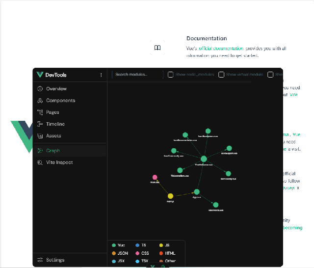
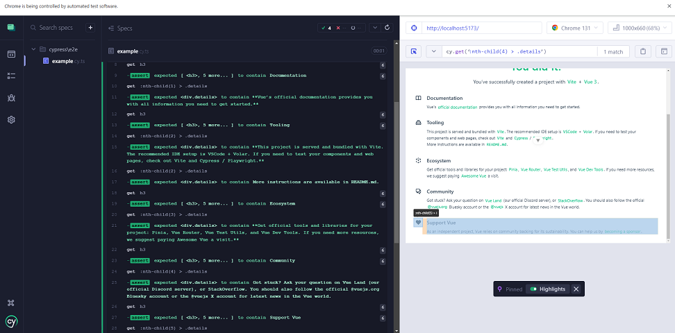

# vue_typescript_001

This template should help get you started developing with Vue 3 in Vite.



run with default command : 

```
npm run test:e2e:dev
```

you can write your cypress test , I wrote my own test with *__cypress__* no other nodejs packages. 




## Recommended IDE Setup

[VSCode](https://code.visualstudio.com/) + [Volar](https://marketplace.visualstudio.com/items?itemName=Vue.volar) (and disable Vetur).

## Type Support for `.vue` Imports in TS

TypeScript cannot handle type information for `.vue` imports by default, so we replace the `tsc` CLI with `vue-tsc` for type checking. In editors, we need [Volar](https://marketplace.visualstudio.com/items?itemName=Vue.volar) to make the TypeScript language service aware of `.vue` types.

## Customize configuration

See [Vite Configuration Reference](https://vite.dev/config/).

## Project Setup

```sh
npm install
```

### Compile and Hot-Reload for Development

```sh
npm run dev
```

### Type-Check, Compile and Minify for Production

```sh
npm run build
```

### Run Headed Component Tests with [Cypress Component Testing](https://on.cypress.io/component)

```sh
npm run test:unit:dev # or `npm run test:unit` for headless testing
```

### Run End-to-End Tests with [Cypress](https://www.cypress.io/)

```sh
npm run test:e2e:dev
```

This runs the end-to-end tests against the Vite development server.
It is much faster than the production build.

But it's still recommended to test the production build with `test:e2e` before deploying (e.g. in CI environments):

```sh
npm run build
npm run test:e2e
```

### Lint with [ESLint](https://eslint.org/)

```sh
npm run lint
```

## These commands from my terminal : 

```sh
C:\>cd VueProjects

C:\VueProjects>npm create vue@latest

> npx
> create-vue


Vue.js - The Progressive JavaScript Framework

√ Project name: ... vue_typescript_001
√ Add TypeScript? ... No / Yes
√ Add JSX Support? ... No / Yes
√ Add Vue Router for Single Page Application development? ... No / Yes
√ Add Pinia for state management? ... No / Yes
√ Add Vitest for Unit Testing? ... No / Yes
√ Add an End-to-End Testing Solution? » Cypress
√ Add ESLint for code quality? » Yes
√ Add Prettier for code formatting? ... No / Yes

Scaffolding project in C:\VueProjects\vue_typescript_001...

Done. Now run:

  cd vue_typescript_001
  npm install
  npm run dev


C:\VueProjects>cd vue_typescript_001

C:\VueProjects\vue_typescript_001>npm install

added 475 packages, and audited 476 packages in 34s

126 packages are looking for funding
  run `npm fund` for details

found 0 vulnerabilities

C:\VueProjects\vue_typescript_001>npm run dev

> vue_typescript_001@0.0.0 dev
> vite


  VITE v6.0.7  ready in 688 ms

  ➜  Local:   http://localhost:5173/
  ➜  Network: use --host to expose
  ➜  Vue DevTools: Open http://localhost:5173/__devtools__/ as a separate window
  ➜  Vue DevTools: Press Alt(⌥)+Shift(⇧)+D in App to toggle the Vue DevTools
  ➜  press h + enter to show help
```
